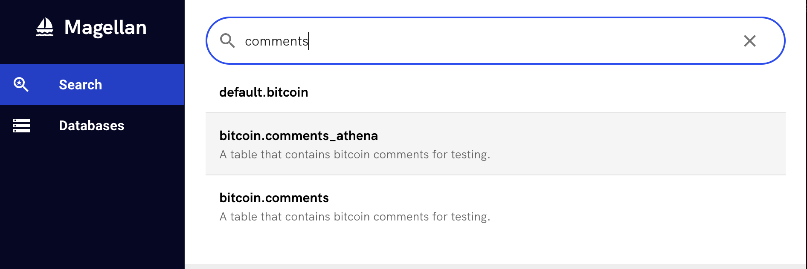
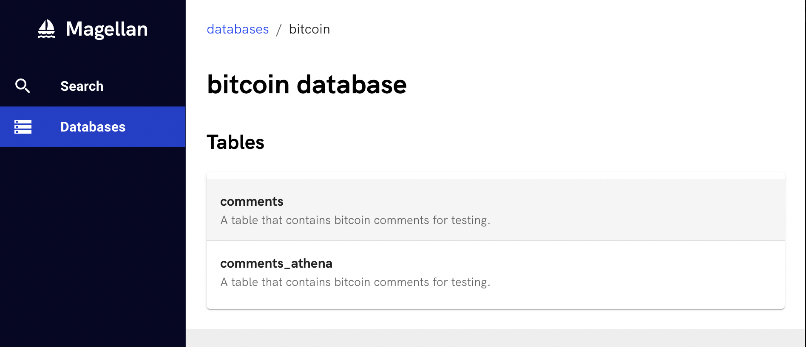
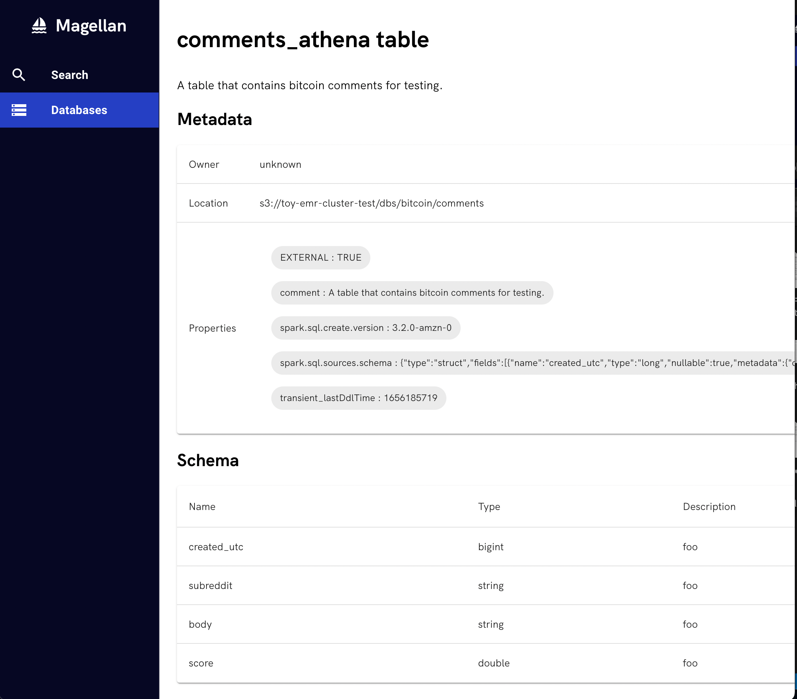

# Magellan

Magellan makes it easier for your data scientists, machine learning engineers, and analysts to discover data within your organization by providing a nicer UI on top of the [AWS Glue Data Catalog](https://docs.aws.amazon.com/glue/latest/dg/components-overview.html#data-catalog-intro).

## Features

### Full text search for tables defined in your metastore

### Browse tables in your metastore

### Schema & Metadata Discovery

### Future Features

- Lineage
- OIDC authentication (e.g. Okta)

## Why Use Magellan?

Magellan might be a good fit for you if:

- You're on AWS

- You like the deep integration AWS Glue Data Catalog offers with other AWS servies like Athena, and Hive metastore compatable frameworks such as Apache Spark.

- You'd like to expose AWS Glue's catalog via a nicer UI / allow employees to authenticate via OIDC without needing AWS credentials.

- You want to get up and running with a minimal amount of infrastructure and don't want to have to touch Hadoop, K8s and/or EKS

### Alternatives

Magellan's goals overlap with other open source offerings such as: [Amundsen](https://www.amundsen.io/amundsen/), [Apache Atlas](https://atlas.apache.org/#/) and [DataHub](https://datahubproject.io/).

Generally speaking these other options are more feature rich, but require a lot more infrastructure setup compared to Magellan.
